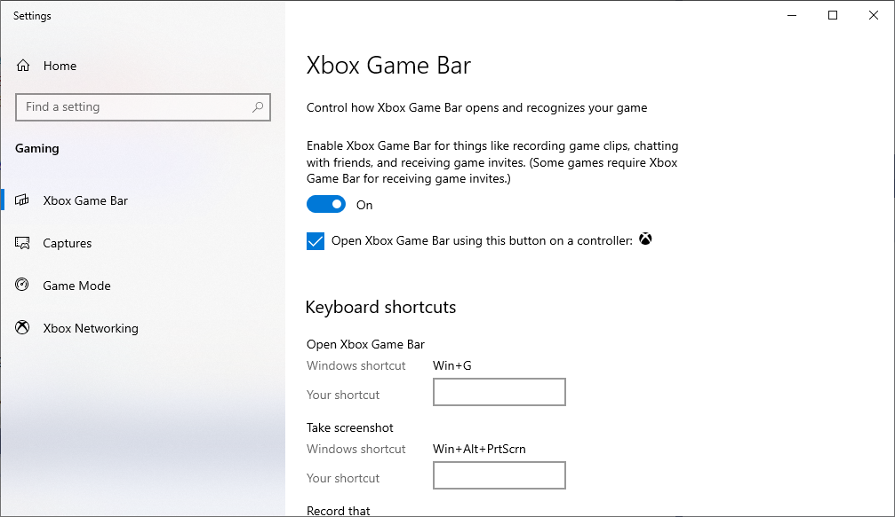

## Update ##

* **NEW: Check out the Razer Chroma RGB for Streamers [Twitch Extension](https://dashboard.twitch.tv/extensions/0bjhmu40mf9oxnn604lpcmbe8iczen) Twitch extension and [Xbox Gamebar Widget](https://www.microsoft.com/store/apps/9PG8DNKL06M6). This is now the latest official version of this app!**

* Check out [channels streaming Chroma RGB](https://htmlpreview.github.io/?https://github.com/tgraupmann/ChromaTwitchExtension/blob/master/streamers.html)

## Quick Start ##

* Install [Synapse](https://www.razer.com/synapse-3)

* Make sure the Chroma Connect module is installed.

* If you don't have Chroma hardware, you can see Chroma effects with the [Chroma Emulator](https://github.com/razerofficial/ChromaEmulator)

* Make sure `Xbox Game Bar` is turned on for `Windows Key` + `G` to open the widget.

## Videos ##

**Setup Instructions**

## Support

Contact `Tim Graupmann#0611` on Discord for support.
