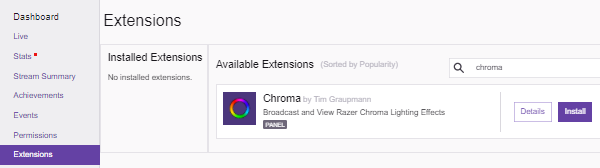
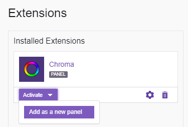
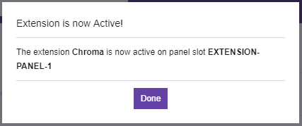
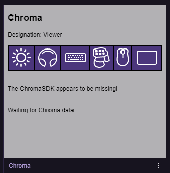
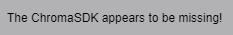
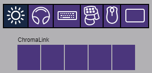
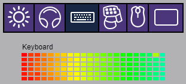
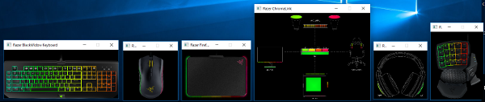

# Chroma - Twitch Extension
(Unofficial) The `Chroma` Twitch Extension adds `Chroma` lighting to the live channel. `Broadcasters` can send `Chroma` lighting from their favorite `Chroma` enabled games. `Viewers` will be able to see `Chroma` lighting while watching the live channel.

## Table of Contents

* [See Also](#see-also)
* [Releases](#releases)
* [Supported Hardware](#supported-hardware)
* [Dependencies](#dependencies)
* [Quick Start for `All Users`](#quick-start-for-all-users)
* [Quick Start for the `Broadcaster`](#quick-start-for-the-broadcaster)
* [Quick Start for the `Viewer`](#quick-start-for-the-viewer)
* [Overview](#Overview)

## See Also

- [ChromaClientForDiscord](https://github.com/tgraupmann/ChromaDiscordApp) - Add Chroma lighting to the Discord App events

- [ChromaClientForMixer](https://github.com/tgraupmann/ChromaClientForMixer) - Add Chroma lighting to the Mixer streaming experience

- [ChromaClientForTwitch](https://github.com/tgraupmann/ChromaTwitchExtension) - Add Chroma lighting to the Twitch streaming experience

**Plugins:**

- [CChromaEditor](https://github.com/RazerOfficial/CChromaEditor) - C++ native MFC library for playing and editing Chroma animations

- [GameMakerChromaExtension](https://github.com/RazerOfficial/GameMakerChromaExtension) - GameMaker extension to control lighting for Razer Chroma

- [HTML5ChromaSDK](https://github.com/RazerOfficial/HTML5ChromaSDK) - JavaScript library for playing Chroma animations

- [UE4ChromaSDKRT](https://github.com/RazerOfficial/UE4ChromaSDKRT) - UE4 runtime module with Blueprint library for the ChromaSDK

- [UnityNativeChromaSDK](https://github.com/RazerOfficial/UnityNativeChromaSDK) - Unity native library for the ChromaSDK

## Releases

* [Chroma Client for Twitch Installer](https://github.com/tgraupmann/ChromaTwitchExtension/releases) for Windows

* [ChromaRGB](https://www.twitch.tv/ext/uj083ccgn6mx5g7i977pqaex7utxsz-0.0.8) Twitch Extension

## Supported Hardware

* [Synapse 2 Supported Devices](http://developer.razer.com/works-with-chroma/compatible-devices/)

* [Synapse 3 Supported Devices](https://www.razer.com/synapse-3)

## Dependencies

* [Razer Synapse](https://www.razer.com/synapse) - Control `Chroma` application priority

* Razer Chroma SDK - Allow applications to control `Chroma` lighting. The `ChromaSDK` is automatically installed by `Synapse` when a `Chroma` device is connected.

* `Chroma Client for Twitch` - Required for the `broadcaster` in order to send Chroma data

## Quick Start for `All Users`

* Open the extension dashboard and search for `Chroma`

* Install the [Chroma RGB](https://www.twitch.tv/ext/uj083ccgn6mx5g7i977pqaex7utxsz-0.0.8) Twitch Extension

* Activate the `Chroma Twitch Extension`

* If this is your first extension, click `Add as a new panel`, or add to an existing panel

* See the full list of games with `Choma` lighting in the [Chroma Workshop](https://www2.razer.com/chroma-workshop/games)

## Quick Start for the `Broadcaster`

* The `broadcaster` can begin or end streaming video at any time using the preferred streaming software. The same is true for broadcasting `Chroma` data.

* Install `Synpase`

* Connect a supported `Chroma Enabled` device

* Install and run the `Chroma Client for Twitch` application

* The initial status will show that the user needs to authorize the `Twitch` session. This will also happen if the user's session has expired from the application being closed. The application will auto renew the `Twitch` session once the user has been authorized.

* Chroma data cannot be sent until the Twitch session has been authenticated.

* The preferred browser can be selected in the `Preferences` which is used for session authentication.

* Click the `Authorize Twitch` button to authorize the Twitch session

* The preferred browser will open to authorize the Twitch session. Once authenticated the page will redirect to the `broadcaster's` Twitch channel.

* With the extension active, the `Chroma` panel should be active on the `broadcaster's` live channel. The `designation` should show as `broadcaster`. The `broadcaster` channel browser page does not need to be open in order to send `Chroma` data.

* With the Twitch session authenticated, the `Chroma Client for Twitch` will enable the `Broadcast on Twitch` checkbox.

* When `Broadcast on Twitch` is unchecked, the status should show `Ready to send Chroma data...`.

* Check the `Broadcast on Twitch` checkbox

* When `Broadcast on Twitch` is checked, the status should show `Sending Chroma data...`.

## Quick Start for the `Viewer`

* With the extension active, the `Chroma` panel should be displayed on the rlive channel. On a `viewer` account the `designation` should show as `Viewer`. The `viewer` panel does need to be open in the browser in order to see the video and `Chroma` data.

* `Chroma` lighting can only be displayed on `Chroma` hardware if the `ChromaSDK` is installed. A message will display if the `ChromaSDK` is not found.

* Regardless whether the `ChromaSDK` is installed, the `Viewer` can toggle virtual devices (ChromaLink, Headset, Keyboard, Keypad, Mouse, Mousepad) to see the `Chroma` data.

* While the `broadcaster` is not streaming `Chroma` data, the message `Waiting for Chroma data...` will appear.

* While the `broadcaster` is streaming `Chroma` data, the message `Receiving Chroma data...` will appear.

* When a virtual device is toggled, `Chroma` data will display.

* When the `ChromaSDK` is detected, the `Chroma` hardware lighting will be controlled by receiving `Chroma` data.

## Overview

When `Launch at Startup` is checked, the application will launch when the user logs into Windows.

