# Chroma - Twitch Extension
(Unofficial) The `Chroma` Twitch Extension adds Chroma lighting to the live channel.

## Table of Contents

* [Releases](#releases)

* [Dependencies](#dependencies)

* [Quick Start for `All Users`](#quick-start-for-all-users)

* [Quick Start for the `Broadcaster`](#quick-start-for-the-broadcaster)

* [Quick Start for the `Viewer`](#quick-start-for-the-viewer)

* [Overview](#Overview)

## Releases

* [Chroma Relay Installer](https://github.com/tgraupmann/ChromaTwitchExtension/releases) for Windows

## Dependencies

* [Razer Synapse](https://www.razerzone.com/synapse) - Control `Chroma` application priority

* [Razer Chroma SDK](http://developer.razerzone.com/works-with-chroma/download/) - Allow applications to control `Chroma` lighting. The `ChromaSDK` is automatically installed by `Synapse` when a `Chroma` device is connected.

* `Chroma Relay` - Required for the `broadcaster` in order to send Chroma data

## Quick Start for `All Users`

* Install the [Chroma Twitch Extension](https://www.twitch.tv/ext/68yadm5zjklpm8jmmxjso3kgjp76n5-0.0.1)

* Add the `Chroma Twitch Extension` to an extension panel and activate

## Quick Start for the `Broadcaster`

* The `broadcaster` can begin or end streaming video at any time using the preferred streaming software. The same is true for broadcasting `Chroma` data.

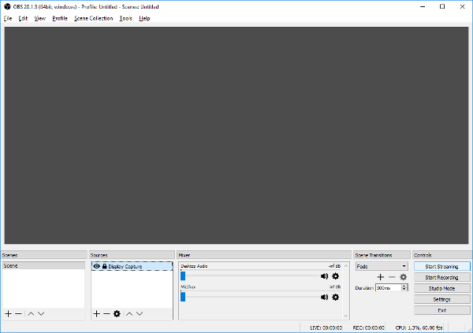

* Install `Synpase`

* Install `ChromaSDK`

* Install and run the `Chroma Relay`

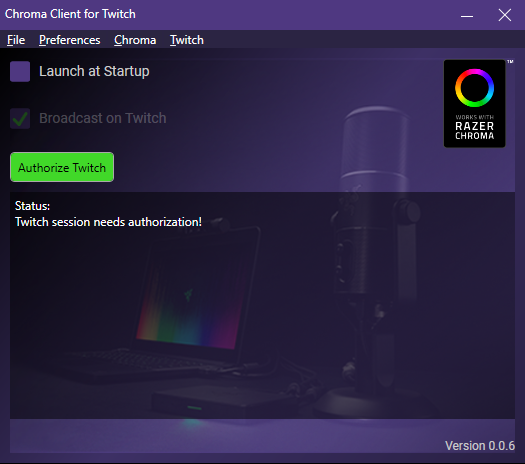

* The initial status will show that the user needs to authorize the `Twitch` session. This will also happen if the user's session has expired from the application being closed. The application will auto renew the `Twitch` session once the user has been authorized.

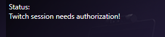

* Chroma data cannot be sent until the Twitch session has been authenticated.

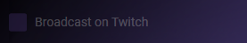

* The preferred browser can be selected in the `Preferences` which is used for session authentication.

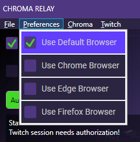

* Click the `Authorize Twitch` button to authorize the Twitch session

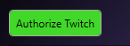

* The preferred browser will open to authorize the Twitch session. Once authenticated the page will redirect to the `broadcaster's` Twitch channel.

* With the extension active, the `Chroma` panel should be active on the `broadcaster's` live channel. The `designation` should show as `broadcaster`. The `broadcaster` channel browser page does not need to be open in order to send `Chroma` data. 

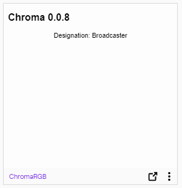

* With the Twitch session authenticated, the `Chroma Relay` will enable the `Broadcast on Twitch` checkbox.

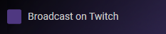

* When `Broadcast on Twitch` is unchecked, the status should show `Ready to send Chroma data...`.

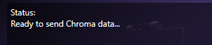

* Check the `Broadcast on Twitch` checkbox

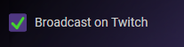

* When `Broadcast on Twitch` is checked, the status should show `Sending Chroma data...`.

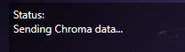

## Quick Start for the `Viewer`

## Overview

When `Launch at Startup` is checked, the application will launch when the user logs into Windows.

